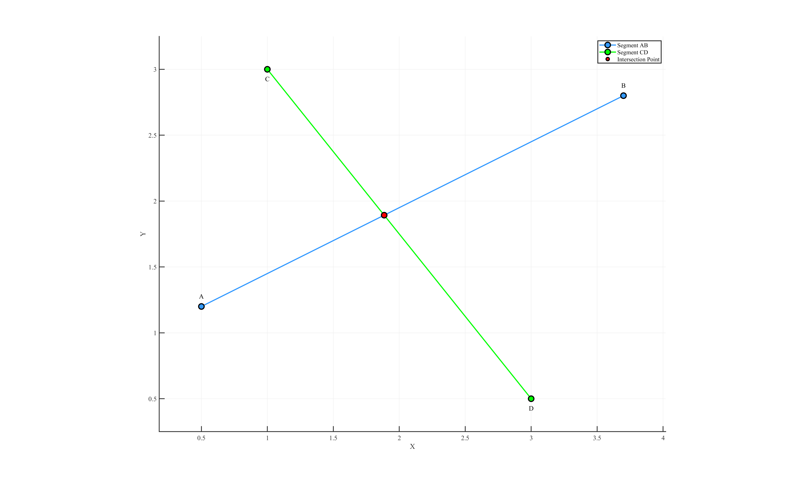

# **Welcome to LiteGeometry**

{ width=500 }


## **About The Project**
[LiteGeometry](https://github.com/ZhikangLai/LiteGeometry) is a lightweight C++ library — built on top of [Eigen](https://eigen.tuxfamily.org/index.php?title=Main_Page) — that delivers high-performance 2D and 3D computational geometry and path-planning utilities.

<p align="center">
  
</p>

Whether you're building quick prototypes or deploying models in production, LiteGeometry ensures a fast, reliable, and scalable experience.

---


## **Why Use LiteGeometry?**

- **Simplicity**: Clean and intuitive API design that makes the library easy to use and integrate.

- **Performance**: Efficient implementations for common geometry and planning tasks.

- **Utility**: A wide selection of common geometric algorithms and advanced path planning techniques.

---

## **Key Modules**


1. **Core Geometry Utilities**

    Provides fundamental 2D/3D geometry operations, such as:

    - Containment queries for points relative to lines, polygons, and polyhedra.
    - Exact intersection tests between segments and other shapes (lines, polygons, and polyhedra), including precise computation of intersection points.

2. **Advanced Modeling Algorithms**

    Supports advanced modeling tasks, including:

    - Oriented Bounding Box (OBB) construction in both 2D and 3D.
    - Rasterization routines for lines, polygons, and polyhedron surfaces.
    - A pinhole-camera model for projecting 3D points onto a 2D image plane.

3. **Path Planning**

    Specialized algorithms for efficient pathfinding:

    - Two optimized 3D Jump-Point Search (JPS) implementations for large-scale environments.

---

## **Development Environment**

This library is actively developed and tested with:

- **Compiler**: MSVC 2022 (C++17 mode)
- **Eigen**: 3.4.90
- **CGAL**: 5.6
- **Boost**: 1.87.0
- **Abseil**: 20240116

---

## **Examples and tutorials**
Explore LiteGeometry extensive list of examples and tutorials to get you started with LiteGeometry. You can find them [here](examples.md).

---

## **Quick Start** 
LiteGeometry defines explicit types for segments, rays, and infinite lines in 2D and 3D:

```cpp
// -------- 2-D --------
struct Segment2D { Eigen::RowVector2d P1, P2; };
struct Ray2D     { Eigen::RowVector2d P1, P2; };  // Direction: P1 ➜ P2
struct Line2D    { Eigen::RowVector2d P1, P2; };

// -------- 3-D --------
struct Segment3D { Eigen::RowVector3d P1, P2; };
struct Ray3D     { Eigen::RowVector3d P1, P2; };  // Direction: P1 ➜ P2
struct Line3D    { Eigen::RowVector3d P1, P2; };
```

> 💡**Tip:** All line-based utilities accept these primitives directly.

Import Header:
```cpp
#include "LiteGeometry.h"
```

Check if two 2D segments intersect and compute the intersection point:
```cpp
int main(){
    Eigen::RowVector2d A(0.5, 1.2);
    Eigen::RowVector2d B(3.7, 2.8);
    Segment2D AB{ A , B };

    Eigen::RowVector2d C(1.0, 3.0);
    Eigen::RowVector2d D(3.0, 0.5);
    Segment2D CD{ C , D };

    Eigen::RowVector2d intersection;
    bool isIntersection = isLinesIntersection2D(AB, CD, intersection);

    if (isIntersection) {
        std::cout << "Intersection Point:\n"
            << intersection.format(Eigen::FullPrecision) << std::endl;
    }

}
```

Output:
```text 
Intersection Point:
1.8857142857142859 1.8928571428571428
```


<a id="close-lightbox" style="display: none;"></a>
<div class="single-img-container">
    <a href="#lightbox-single-1" class="lightbox-trigger">
         
    </a>
</div>

<div id="lightbox-single-1" class="lightbox">
    <a href="#close-lightbox" class="lightbox-close">&times;</a>
    
</div>


Check if two 2D rays intersect and compute the intersection point:
```cpp
int main(){
    Eigen::RowVector2d A(0.0, 0.0);
    Eigen::RowVector2d B(3.0, 0.9);
    Ray2D AB{ A , B };

    Eigen::RowVector2d C(0.5, 3.2);
    Eigen::RowVector2d D(2.3, 2.5);
    Ray2D CD{ C , D };

    Eigen::RowVector2d intersection;
    bool isIntersection = isLinesIntersection2D(AB, CD, intersection);
    if (isIntersection) {
        std::cout << "Intersection Point:\n"
            << intersection.format(Eigen::FullPrecision) << std::endl;
    }

}
```

Output:
```text 
Intersection Point:
4.9274193548387082 1.4782258064516127
```

<div class="single-img-container">
    <a href="#lightbox-single-2" class="lightbox-trigger">
         
    </a>
</div>

<div id="lightbox-single-2" class="lightbox">
    <a href="#close-lightbox" class="lightbox-close">&times;</a>
    
</div>


---

## **License**
LiteGeometry software: [BSD-3-Clause License](https://github.com/ZhikangLai/LiteGeometry/blob/main/LICENSE.txt)
