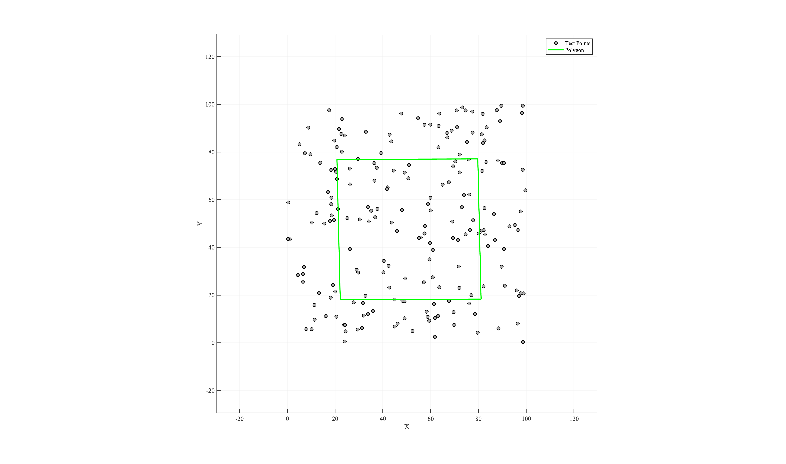

# **filterPointsByPolygon**

Filters a set of 2D points according to their spatial relation to a polygon.  
You can keep or discard points that fall **inside**, **outside**, or **exactly on** the polygon boundary.

---

## **Function Signature**
```cpp
 std::vector<Eigen::RowVector2d> filterPointsByPolygon(
    const Eigen::MatrixX2d& polygonVertices,
    const std::vector<Eigen::RowVector2d>& points,
    bool removeBoundary = true,
    bool removeInside = true,
    bool needClosePolygon = true
);
```
---

## **Parameters**

| Parameter           | Description                                                                 |
|---------------------|-----------------------------------------------------------------------------|
| `polygonVertices`   | `Eigen::MatrixX2d` — Each row is a vertex. If `needClosePolygon` is `true`, the vertices may be unordered or open; the function will sort them counter-clockwise and append the first vertex to close the loop. |
| `points`            | `std::vector<Eigen::RowVector2d>` — the input points to filter.     |
| `removeBoundary`    | `bool` (default: `true`) — if `true`, removes points exactly on the polygon boundary; otherwise keeps them. |
| `removeInside`      | `bool` (default: `true`) — if `true`, removes points strictly inside the polygon; otherwise keeps them. |
| `needClosePolygon`  | `bool` (default: `true`) — `true` → auto-order & close polygonVertices; `false` → assume vertices are already counter-clockwise and closed. |

---

## **Return Value**
- A `std::vector<Eigen::RowVector2d>` containing only those points that remain after filtering.

---

## **Behavior**

| removeInside | removeBoundary | Kept Points                                        |
|--------------|----------------|----------------------------------------------------|
| `false`      | `false`        | Keep inside & boundary; remove outside             |
| `false`      | `true`         | Keep only inside; remove outside & boundary        |
| `true`       | `false`        | Keep outside & boundary; remove inside             |
| `true`       | `true`         | Keep only outside; remove inside & boundary        |


---

## **Example Usage** 

The following demo uses [randomPoints.csv](https://github.com/ZhikangLai/LiteGeometry/testData/randomPoints.csv) from the repository.

### **1. Data Preparation**
```cpp
std::vector<Eigen::RowVector2d> testPoints2D;
testPoints2D.reserve(200);
std::ifstream file("./testData/randomPoints.csv");
std::string line;
while (getline(file, line)) {
    std::istringstream lineStream(line);
    std::string c1, c2;
    if (std::getline(lineStream, c1, ',') &&
        std::getline(lineStream, c2, ',')) {

        Eigen::RowVector2d vec2d;
        vec2d << stod(c1), stod(c2);
        testPoints2D.emplace_back(vec2d);

    }
}

// A simple quadrilateral
Eigen::Matrix<double, 4, 2> polygonVertices;
polygonVertices << 20.785733063246152, 76.974749045767595,
    79.748658377982537, 77.104254429716875,
    81.118930088650117, 18.361256017841775,
    22.15600477391374, 18.231750633892496;
```
<!-- <p align="center">  </p> -->
<a id="close-lightbox" style="display: none;"></a>
<div class="single-img-container">
    <a href="#lightbox-single-1" class="lightbox-trigger">
         
    </a>
</div>

<div id="lightbox-single-1" class="lightbox">
    <a href="#close-lightbox" class="lightbox-close">&times;</a>
    
</div>

### **2. Executing the Filter**
```cpp
// Remove only boundary points, keep inside and outside:
std::vector<Eigen::RowVector2d> insidePoints2D = filterPointsByPolygon(
    polygonVertices, testPoints2D,
    /*removeBoundary=*/true,
    /*removeInside=*/false,
    /*needClosePolygon=*/true
    );
std::cout << "\nNumber of points outside the polygon: " << insidePoints2D.size() << "\n";

// Remove inside and boundary, keep only outside:
std::vector<Eigen::RowVector2d> outsidePoints2D = filterPointsByPolygon(
    polygonVertices, testPoints2D,
    /*removeBoundary=*/true,
    /*removeInside=*/true,
    /*needClosePolygon=*/true
    );
std::cout << "\nNumber of points inside the polygon: " << outsidePoints2D.size() << "\n";
```

### **3. Results**

<div class="single-img-container">
    <a href="#lightbox-single-2" class="lightbox-trigger">
         
    </a>
</div>

<div id="lightbox-single-2" class="lightbox">
    <a href="#close-lightbox" class="lightbox-close">&times;</a>
    
</div>

### **Complete Implementation**

```cpp
#include "LiteGeometry.h"

int main() {

    std::vector<Eigen::RowVector2d> testPoints2D;
    testPoints2D.reserve(200);
    std::ifstream file("./testData/randomPoints.csv");
    std::string line;
    while (getline(file, line)) {
        std::istringstream lineStream(line);
        std::string c1, c2;
        if (std::getline(lineStream, c1, ',') &&
            std::getline(lineStream, c2, ',')) {

            Eigen::RowVector2d vec2d;
            vec2d << stod(c1), stod(c2);
            testPoints2D.emplace_back(vec2d);

        }
    }

    Eigen::Matrix<double, 4, 2> polygonVertices;
    polygonVertices << 20.785733063246152, 76.974749045767595,
        79.748658377982537, 77.104254429716875,
        81.118930088650117, 18.361256017841775,
        22.15600477391374, 18.231750633892496;

    std::vector<Eigen::RowVector2d> insidePoints2D = filterPointsByPolygon(
        polygonVertices, testPoints2D,
        /*removeBoundary=*/true,
        /*removeInside=*/false,
        /*needClosePolygon=*/true
        );
    std::cout << "\nNumber of points outside the polygon: " << insidePoints2D.size() << "\n";

    std::vector<Eigen::RowVector2d> outsidePoints2D = filterPointsByPolygon(
        polygonVertices, testPoints2D,
        /*removeBoundary=*/true,
        /*removeInside=*/true,
        /*needClosePolygon=*/true
        );
    std::cout << "\nNumber of points inside the polygon: " << outsidePoints2D.size() << "\n";
    
    return 0;
}
```

