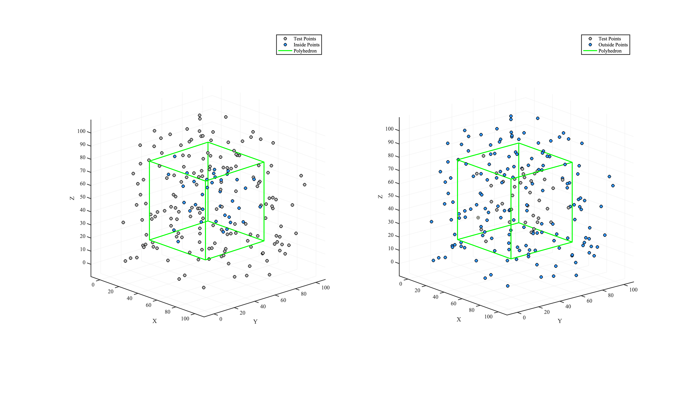

# **filterPointsByPolyhedron**


Filters a set of 3D points according to their spatial relationship to a polyhedron. 
Depending on the specified options, points located **inside**, **outside**, or **exactly on** the polyhedron’s faces can be either retained or discarded.

---

## **Function Signature**
```cpp
std::vector<Eigen::RowVector3d> filterPointsByPolyhedron(
    const Eigen::MatrixX3d& polyhedronVertices,
    const std::vector<Eigen::RowVector3d>& points,
    bool removeBoundary = true,
    bool removeInside = true
);
```
---

## **Parameters**

| Parameter               | Description                                                                                  |
|-------------------------|----------------------------------------------------------------------------------------------|
| `polyhedronVertices`    | `Eigen::MatrixX3d` — each row specifies the coordinates of a vertex of the polyhedron.      |
| `points`                | `std::vector<Eigen::RowVector3d>` — the 3D points to be filtered.                            |
| `removeBoundary`        | `bool` (default: `true`) — if `true`, points lying exactly on the polyhedron’s surface are discarded; otherwise they are kept. |
| `removeInside`          | `bool` (default: `true`) — if `true`, points strictly inside the polyhedron are discarded; otherwise they are kept. |


---

## **Return Value**
- `std::vector<Eigen::RowVector3d>` — the subset of points that satisfy the filtering criteria..


---

## **Behavior**

| removeInside | removeBoundary | Kept Points                                       |
|--------------|----------------|----------------------------------------------------|
| `false`      | `false`        | Inside & boundary; removes only points outside     |
| `false`      | `true`         | Inside only; removes boundary & outside            |
| `true`       | `false`        | Outside & boundary; removes only points inside     |
| `true`       | `true`         | Outside only; removes inside & boundary            |


---

## **Example Usage**

The following example uses [randomPoints.csv](https://github.com/ZhikangLai/LiteGeometry/testData/randomPoints.csv) from the repository.


### **1. Data Preparation**
```cpp
std::vector<Eigen::RowVector3d> testPoints3D;
testPoints3D.reserve(200);
std::ifstream file("./testData/randomPoints.csv");
std::string line;
while (getline(file, line)) {
    std::istringstream lineStream(line);
    std::string c1, c2, c3;
    if (std::getline(lineStream, c1, ',') &&
        std::getline(lineStream, c2, ',') &&
        std::getline(lineStream, c3)) {

        Eigen::RowVector3d vec3d;
        vec3d << stod(c1), stod(c2), stod(c3);
        testPoints3D.emplace_back(vec3d);

    }
}

Eigen::Matrix<double, 8, 3> polyhedronVertices;
polyhedronVertices << 20.785733063246152, 76.974749045767595, 20.082613534316067,
    79.748658377982537, 77.104254429716875, 20.082613534316067,
    81.118930088650117, 18.361256017841775, 20.082613534316067,
    22.15600477391374, 18.231750633892496, 20.082613534316067,
    20.785733063246152, 76.974749045767595, 80.113871877439578,
    79.748658377982537, 77.104254429716875, 80.113871877439578,
    81.118930088650117, 18.361256017841775, 80.113871877439578,
    22.15600477391374, 18.231750633892496, 80.113871877439578;
```

<a id="close-lightbox" style="display: none;"></a>
<div class="single-img-container">
    <a href="#lightbox-single-1" class="lightbox-trigger">
         
    </a>
</div>

<div id="lightbox-single-1" class="lightbox">
    <a href="#close-lightbox" class="lightbox-close">&times;</a>
    
</div>


### **2. Executing the Filter**
```cpp
std::vector<Eigen::RowVector3d> insidePoints3D = filterPointsByPolyhedron(
    polyhedronVertices, testPoints3D,
    /*removeBoundary=*/false,
    /*removeInside=*/false
    );
std::cout << "\nNumber of points inside the polyhedron: " << insidePoints3D.size() << "\n";

std::vector<Eigen::RowVector3d> outsidePoints3D = filterPointsByPolyhedron(
    polyhedronVertices, testPoints3D,
    /*removeBoundary=*/false,
    /*removeInside=*/true
    );
std::cout << "\nNumber of points outside the polyhedron: " << outsidePoints3D.size() << "\n";
```

### 3. Results
<!-- <p align="center">  </p> -->

<a id="close-lightbox" style="display: none;"></a>
<div class="single-img-container">
    <a href="#lightbox-single-2" class="lightbox-trigger">
         
    </a>
</div>

<div id="lightbox-single-2" class="lightbox">
    <a href="#close-lightbox" class="lightbox-close">&times;</a>
    
</div>


### **Complete Implementation**

```cpp
#include "LiteGeometry.h"

int main() {

    std::vector<Eigen::RowVector3d> testPoints3D;
    testPoints3D.reserve(200);
    std::ifstream file("./testData/randomPoints.csv");
    std::string line;
    while (getline(file, line)) {
        std::istringstream lineStream(line);
        std::string c1, c2, c3;
        if (std::getline(lineStream, c1, ',') &&
            std::getline(lineStream, c2, ',') &&
            std::getline(lineStream, c3)) {

            Eigen::RowVector3d vec3d;
            vec3d << stod(c1), stod(c2), stod(c3);
            testPoints3D.emplace_back(vec3d);

        }
    }

    Eigen::Matrix<double, 8, 3> polyhedronVertices;
    polyhedronVertices << 20.785733063246152, 76.974749045767595, 20.082613534316067,
        79.748658377982537, 77.104254429716875, 20.082613534316067,
        81.118930088650117, 18.361256017841775, 20.082613534316067,
        22.15600477391374, 18.231750633892496, 20.082613534316067,
        20.785733063246152, 76.974749045767595, 80.113871877439578,
        79.748658377982537, 77.104254429716875, 80.113871877439578,
        81.118930088650117, 18.361256017841775, 80.113871877439578,
        22.15600477391374, 18.231750633892496, 80.113871877439578;


    std::vector<Eigen::RowVector3d> insidePoints3D = filterPointsByPolyhedron(
        polyhedronVertices, testPoints3D,
        /*removeBoundary=*/false,
        /*removeInside=*/false
        );
    std::cout << "\nNumber of points inside the polyhedron: " << insidePoints3D.size() << "\n";

    std::vector<Eigen::RowVector3d> outsidePoints3D = filterPointsByPolyhedron(
        polyhedronVertices, testPoints3D,
        /*removeBoundary=*/false,
        /*removeInside=*/true
        );
    std::cout << "\nNumber of points outside the polyhedron: " << outsidePoints3D.size() << "\n";
    
    return 0;
}
```