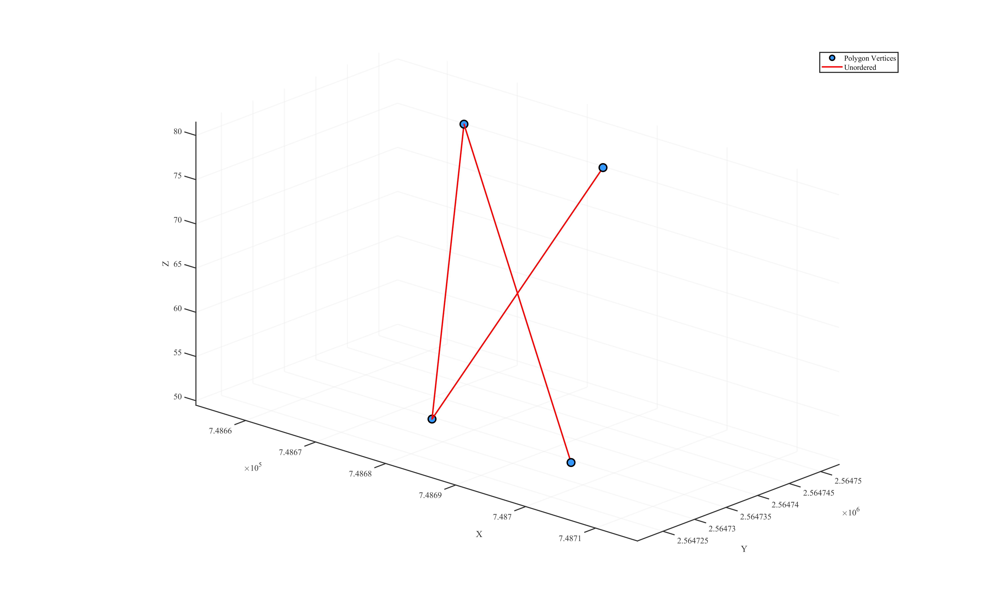
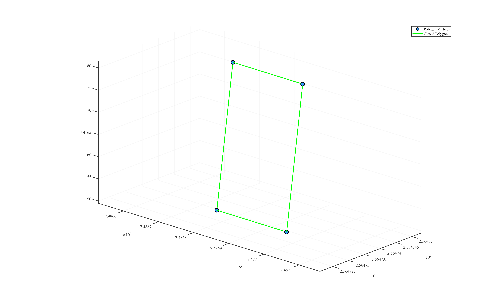

# **generateClosedPolygon**


Generates a closed polygon from an unordered set of 2D points or coplanar 3D points.  

---

## **Function Signature**
```cpp
Eigen::MatrixXd generateClosedPolygon(
    const Eigen::MatrixXd& polygonVertices
);
```

---

## **Parameters**
- **polygonVertices**:
  An `Eigen::MatrixXd` of size `N×2` (for 2D) or `N×3` (for coplanar 3D), representing the unordered vertices of the polygon.

---

## **Return Value**

- An `Eigen::MatrixXd` containing the input vertices reordered in counter-clockwise sequence, with the first vertex repeated at the end to close the loop.

---

## **Example Usage** 

### **1. Define Unordered Points**

```cpp
Eigen::Matrix<double,4,3> unorderedVertices;
unorderedVertices << 748694.4250704022, 2564734.3476669602, 49.5,
    748674.4539194419, 2564739.5306861168, 81.5,
    748674.4154279609, 2564734.5007915981, 49.5,
    748694.4635618832, 2564739.3775614789, 81.5;
```

If you connect these points in their given order, you obtain an open, zig-zag path rather than a closed polygon.
<!-- <p align="center">  </p> -->
<a id="close-lightbox" style="display: none;"></a>
<div class="single-img-container">
    <a href="#lightbox-single-1" class="lightbox-trigger">
         
    </a>
</div>

<div id="lightbox-single-1" class="lightbox">
    <a href="#close-lightbox" class="lightbox-close">&times;</a>
    
</div>


### **2. Executing the Function**
Call the function to compute the centroid, sort the points, and close the polygon:

```cpp
Eigen::MatrixX3d polygon = generateClosedPolygon(unorderedVertices);
```

After the call, `polygon` contains the vertices in counter-clockwise order, with the first point repeated at the end to form a closed loop:
<!-- <p align="center">  </p> -->

<div class="single-img-container">
    <a href="#lightbox-single-2" class="lightbox-trigger">
         
    </a>
</div>

<div id="lightbox-single-2" class="lightbox">
    <a href="#close-lightbox" class="lightbox-close">&times;</a>
    
</div>


### **Complete Implementation**
```cpp
#include "LiteGeometry.h"

int main() {

    Eigen::Matrix<double,4,3> unorderedVertices;
    unorderedVertices << 748694.4250704022, 2564734.3476669602, 49.5,
        748674.4539194419, 2564739.5306861168, 81.5,
        748674.4154279609, 2564734.5007915981, 49.5,
        748694.4635618832, 2564739.3775614789, 81.5;

    Eigen::MatrixX3d polygon = generateClosedPolygon(unorderedVertices);
    std::cout << "[Input] Original unordered vertices (n x 3):\n";
    std::cout << unorderedVertices.format(Eigen::FullPrecision) << "\n\n";

    std::cout << "[Output] Generated closed polygon (n x 3):\n";
    std::cout << polygon.format(Eigen::FullPrecision) << "\n";
    
    return 0;
}
```
