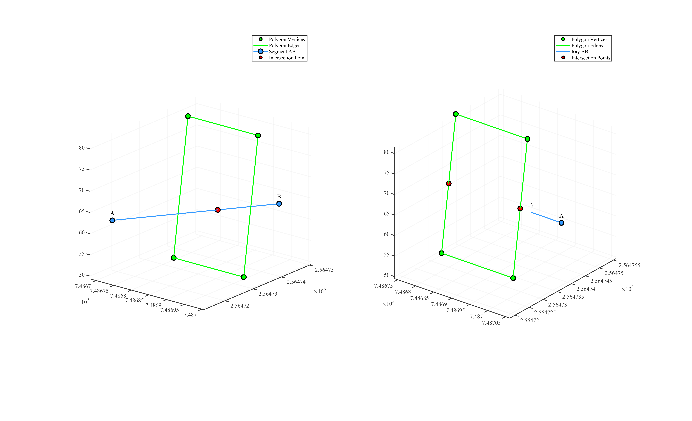

# **isLinePolygonIntersection (2D & 3D)**
Determine whether a line primitive (segment, ray, or infinite line) intersects a polygon in 2D or 3D space.


## **2D Intersection**
### **Function Signatures**
```cpp
// Returns true if geoAB intersects the polygon. Optionally outputs all intersection points.
template<typename LineT>
bool isLinePolygonIntersection2D(
    const Eigen::MatrixX2d& polygonVertices,
    const LineT& geoAB,
    std::vector<Eigen::RowVector2d>& intersections,
    bool needClosePolygon = true
);

// Overload that does not compute intersection coordinates..
template<typename LineT>
bool isLinePolygonIntersection2D(
    const Eigen::MatrixX2d& polygonVertices,
    const LineT& geoAB,
    bool needClosePolygon = true
);
```

### **Parameters**
- `polygonVertices` (`Eigen::MatrixX2d`):
    - Each row is a 2D vertex (`N×2`).
    - If `needClosePolygon` is `true`, the vertices are automatically ordered counter-clockwise, and the first vertex is appended to close the loop.

- `geoAB` (`LineT`): 2D line primitive (`Segment2D`, `Ray2D`, `Line2D`).
- `intersections` (`std::vector<Eigen::RowVector2d>&`): If provided, receives all intersection points.
- `needClosePolygon` (`bool`, default `true`): 
    - `false`: `polygonVertices` must already form an ordered, closed polygon.
    - `true`: the function will sort and close the polygon for you.

### **Return Value**
- `true` if at least one intersection exists; otherwise `false`.

## **3D Intersection**
### **Function Signatures**
```cpp
// Returns true if geoAB intersects the coplanar 3D polygon, and fills intersections.
template<typename LineT>
bool isLinePolygonIntersection3D(
    const Eigen::MatrixX3d& polygonVertices,
    const LineT& geoAB,
    std::vector<Eigen::RowVector3d>& intersections,  
    bool checkBoundary,                             
    bool needClosePolygon                          
);

// Overload without collecting intersection coordinates.
template<typename LineT>
bool isLinePolygonIntersection3D(
    const Eigen::MatrixX3d& polygonVertices,
    const LineT& geoAB,
    bool checkBoundary,
    bool needClosePolygon
);
```

### **Parameters**
- `polygonVertices` (`Eigen::MatrixX3d`):
    - Each row is a coplanar 3-D vertex (`N×3`).
    - If `needClosePolygon` is `true`, the vertices are automatically ordered counter-clockwise, and the first vertex is appended to close the loop.

- `geoAB` (`LineT`): 3D line primitive (`Segment2D`, `Ray2D`, `Line2D`).
- `intersections` (`std::vector<Eigen::RowVector3d>&`): Collected 3D intersection points.
- `checkBoundary` (`bool`, default `true`): If `true`, intersections on the polygon edges count; otherwise only strictly interior intersections.
- `needClosePolygon` (`bool`, default `true`): Same semantics as in the 2D version..

### **Return Value**
- `true` if there is at least one intersection; otherwise `false`.

---


## **Example Usage**
```cpp
#include "lightGeo.h"

int main() {

    Eigen::Matrix<double,4,3> unorderedVertices;
    unorderedVertices << 748694.4250704022, 2564734.3476669602, 49.5,
        748674.4539194419, 2564739.5306861168, 81.5,
        748674.4154279609, 2564734.5007915981, 49.5,
        748694.4635618832, 2564739.3775614789, 81.5;
        
    Eigen::MatrixX3d polygon = generateClosedPolygon(unorderedVertices);

    Eigen::RowVector3d A(748674.6211, 2564712.4947, 64.5593);
    Eigen::RowVector3d B(748691.5686, 2564750.4571, 61.6250);
    Segment3D AB{ A ,B };
    std::vector<Eigen::RowVector3d> intersections1;
    bool isIntersection1 = isLinePolygonIntersection3D(polygon, AB, intersections1, true, false);
    std::cout << "\n-- Segment AB Intersection --\n";
    if (isIntersection1) {
        std::cout << "Intersection Points:\n"
                    << intersections1[0].format(Eigen::FullPrecision) << "\n";
    }
    
    std::cout << "\n--------------------------------------------------------\n";

    Eigen::RowVector3d C(748705.94909344427, 2564736.774573423, 65.5);
    Eigen::RowVector3d D(748697.44422830443, 2564736.8396572643, 65.5);
    Ray3D CD{ C ,D };
    std::vector<Eigen::RowVector3d> intersections2;
    bool isIntersection2 = isLinePolygonIntersection3D(polygon, CD, intersections2, true, false);
    std::cout << "\n-- Ray CD Intersection --\n";
    if (isIntersection2) {
        std::cout << "Intersection Points:\n";
        for (const auto& point : intersections2) {
            std::cout << point.format(Eigen::FullPrecision) << "\n";
        }
    }
    
    return 0;
}
```

The figure below visualizes the intersection points between the line primitives (segment and ray) and the 3D polygon.
<!-- <p align="center">  </p> -->

<a id="close-lightbox" style="display: none;"></a>
<div class="single-img-container">
    <a href="#lightbox-single" class="lightbox-trigger">
         
    </a>
</div>

<div id="lightbox-single" class="lightbox">
    <a href="#close-lightbox" class="lightbox-close">&times;</a>
    
</div>